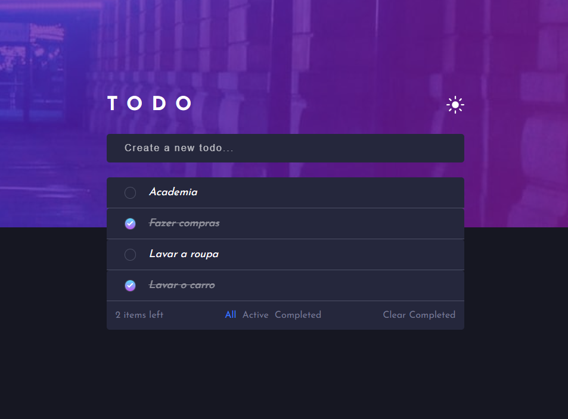

Todo List App

## Visão Geral

### Projeto de uma aplicação Web onde você consegue criar uma lista de tarefas, de forma simples e prática.
#

⏳ Primeira etapa do projeto feita em 6 dias.
#
## Construido com:
- HTML Semântico
- CSS
  - Flexbox
  - Desktop first
- JavaScript

## Funcionalidades
- Criar listas de tarefas
- Filtrar por categorias, 'Ativas' ou 'Completas' 
- Botão para limpar lista de tarefas completadas
- Design adaptável a telas Mobile (Em construção)
- Opção de exibição de tema claro ou escuro (Em construção)

## O que eu aprendi:
- Manipulação do DOM
- Arrays, loops e estilos
- Eventos
- Seletores com JavaScript
- Boas práticas com JavaScript

## Link

Veja o projeto aqui: [Acessar🌍](https://devhiderlan.github.io/ToDo-List-App/)

## Autor

Hiderlan Santana: [Linkedin](https://www.linkedin.com/in/hiderlan-santana/)